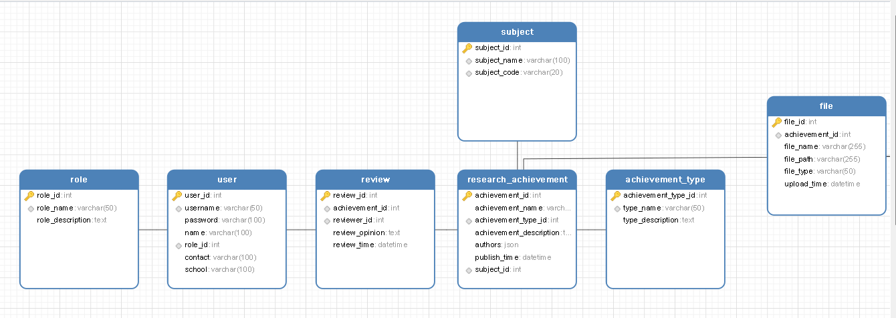

# 高校科研成果管理系统

## 后端

### 数据库表设计

#### 构思

1. 用户表(user)：存储用户的基本信息，包括用户ID、用户名、密码、姓名、所属角色（外键关联角色表科研人员、管理员、评审专家）、联系方式、学校。用户角色字段用于区分不同用户权限，如科研人员、管理员等。
2. 角色表(role)：定义系统中角色类型以及权限范围，包括角色ID、角色名称、角色描述，实现基于角色的访问控制
3. 科研成果表(research_achievement)：存储科研成果的详细信息，包括成果ID、成果名称、成果类型（论文、专利、题目等等）、成果描述、作者列表(Json格式存储)、发表时间、所属学科。
4. 成果类型表(achievement_type)：对科研成果的类型进行分类管理，包括类型ID、类型名称、类型描述。通过外键与科研成果表关联，实现对科研成果类型的约束和查询。
5. 学科表(subject)：存储学科信息，包括学科ID、学科名称、学科代码。科研成果表通过学科字段与学科表关联，便于按学科进行科研成果的统计和分析。
6. 成果评审表(review)：记录科研成果的评审信息，包括评审ID、成果ID、评审人ID、评审意见、评审时间。通过与科研成果表和用户表的关联，实现对科研成果的评审流程管理和评审结果查询。

#### 建表语句

1. 用户表

   ~~~ mysql
   CREATE TABLE user (
       user_id INT AUTO_INCREMENT PRIMARY KEY,
       username VARCHAR(50) NOT NULL UNIQUE,
       password VARCHAR(100) NOT NULL,
       name VARCHAR(100) NOT NULL,
       role_id INT NOT NULL,
       contact VARCHAR(100),
       school VARCHAR(100),
       FOREIGN KEY (role_id) REFERENCES role(role_id)
   );
   ~~~

2. 角色表

   ~~~ mysql
   CREATE TABLE role (
       role_id INT AUTO_INCREMENT PRIMARY KEY,
       role_name VARCHAR(50) NOT NULL UNIQUE,
       role_description TEXT
   );
   ~~~

3. 科研成果表

   ~~~ mysql
   CREATE TABLE research_achievement (
       achievement_id INT AUTO_INCREMENT PRIMARY KEY,
       achievement_name VARCHAR(255) NOT NULL,
       achievement_type_id INT NOT NULL,
       achievement_description TEXT,
       authors JSON,
       publish_time DATETIME,
       subject_id INT NOT NULL,
       FOREIGN KEY (achievement_type_id) REFERENCES achievement_type(achievement_type_id),
       FOREIGN KEY (subject_id) REFERENCES subject(subject_id)
   );
   ~~~

4. 成果类型表

   ~~~ mysql
   CREATE TABLE achievement_type (
       achievement_type_id INT AUTO_INCREMENT PRIMARY KEY,
       type_name VARCHAR(50) NOT NULL UNIQUE,
       type_description TEXT
   );
   ~~~

5. 学科表

   ~~~ mysql
   CREATE TABLE subject (
       subject_id INT AUTO_INCREMENT PRIMARY KEY,
       subject_name VARCHAR(100) NOT NULL UNIQUE,
       subject_code VARCHAR(20) NOT NULL UNIQUE
   );
   ~~~

6. 成果评审表

   ~~~ mysql
   CREATE TABLE review (
       review_id INT AUTO_INCREMENT PRIMARY KEY,
       achievement_id INT NOT NULL,
       reviewer_id INT NOT NULL,
       review_opinion TEXT,
       review_time DATETIME DEFAULT CURRENT_TIMESTAMP,
       FOREIGN KEY (achievement_id) REFERENCES research_achievement(achievement_id),
       FOREIGN KEY (reviewer_id) REFERENCES user(user_id)
   );
   ~~~

7. 实际执行
   ~~~mysql
   -- 1. 角色表 (role)
   CREATE TABLE role (
       role_id INT AUTO_INCREMENT PRIMARY KEY,
       role_name VARCHAR(50) NOT NULL UNIQUE,
       role_description TEXT
   );
   
   -- 2. 学科表 (subject)
   CREATE TABLE subject (
       subject_id INT AUTO_INCREMENT PRIMARY KEY,
       subject_name VARCHAR(100) NOT NULL UNIQUE,
       subject_code VARCHAR(20) NOT NULL UNIQUE
   );
   
   -- 3. 成果类型表 (achievement_type)
   CREATE TABLE achievement_type (
       achievement_type_id INT AUTO_INCREMENT PRIMARY KEY,
       type_name VARCHAR(50) NOT NULL UNIQUE,
       type_description TEXT
   );
   
   -- 4. 用户表 (user)
   CREATE TABLE user (
       user_id INT AUTO_INCREMENT PRIMARY KEY,
       username VARCHAR(50) NOT NULL UNIQUE,
       password VARCHAR(100) NOT NULL,
       name VARCHAR(100) NOT NULL,
       role_id INT NOT NULL,
       contact VARCHAR(100),
       school VARCHAR(100),
       FOREIGN KEY (role_id) REFERENCES role(role_id)
   );
   
   -- 5. 科研成果表 (research_achievement)
   CREATE TABLE research_achievement (
       achievement_id INT AUTO_INCREMENT PRIMARY KEY,
       achievement_name VARCHAR(255) NOT NULL,
       achievement_type_id INT NOT NULL,
       achievement_description TEXT,
       authors JSON,
       publish_time DATETIME,
       subject_id INT NOT NULL,
       FOREIGN KEY (achievement_type_id) REFERENCES achievement_type(achievement_type_id),
       FOREIGN KEY (subject_id) REFERENCES subject(subject_id)
   );
   
   -- 6. 成果评审表 (review)
   CREATE TABLE review (
       review_id INT AUTO_INCREMENT PRIMARY KEY,
       achievement_id INT NOT NULL,
       reviewer_id INT NOT NULL,
       review_opinion TEXT,
       review_time DATETIME DEFAULT CURRENT_TIMESTAMP,
       FOREIGN KEY (achievement_id) REFERENCES research_achievement(achievement_id),
       FOREIGN KEY (reviewer_id) REFERENCES user(user_id)
   );
   ~~~

8. 补充-发现科研成果一定要上传文件，所以新增文件表
   ~~~ mysql
   CREATE TABLE file (
       file_id INT AUTO_INCREMENT PRIMARY KEY,
       achievement_id INT NOT NULL,  -- 外键，关联科研成果表
       file_name VARCHAR(255) NOT NULL,  -- 文件名
       file_path VARCHAR(255) NOT NULL,  -- 文件存储路径
       file_type VARCHAR(50),            -- 文件类型（如 PDF、Word、Excel）
       upload_time DATETIME DEFAULT CURRENT_TIMESTAMP,
       FOREIGN KEY (achievement_id) REFERENCES research_achievement(achievement_id)
   );
   ~~~

9. 补充 - 为了体现对科研成果的保护科研成果表(research_achievement)新增是否公开选项

   ~~~ mysql
   ALTER TABLE research_achievement
   ADD COLUMN is_public TINYINT(1) DEFAULT 0;  -- 0 表示不公开，1 表示公开
   ~~~

   

#### ER图

### 实体类设计

根据数据库表设计和MyBatis-Plus进行实体类的编写

### 用户登录验证模块

1. 使用SpringSecurity为基础安全框架
   （注意这里前后端端口不一样，要显示配置cors以解决跨域问题）
2. 使用io.jsonwebtoken的api生成加密token
3. TokenUtil类生成、验证token（需要时获取到userId）
4. PasswordUtil类加密、比对密码是否正确
5. 使用JwtFilter过滤所有请求，验证每个请求中token的有效性（/login和/register请求不需要）

### 用户管理模块

1. 只有role为1的管理员角色才能管理用户
2. 使用Pagehelper的分页查询，引入pageshelper分页插件
